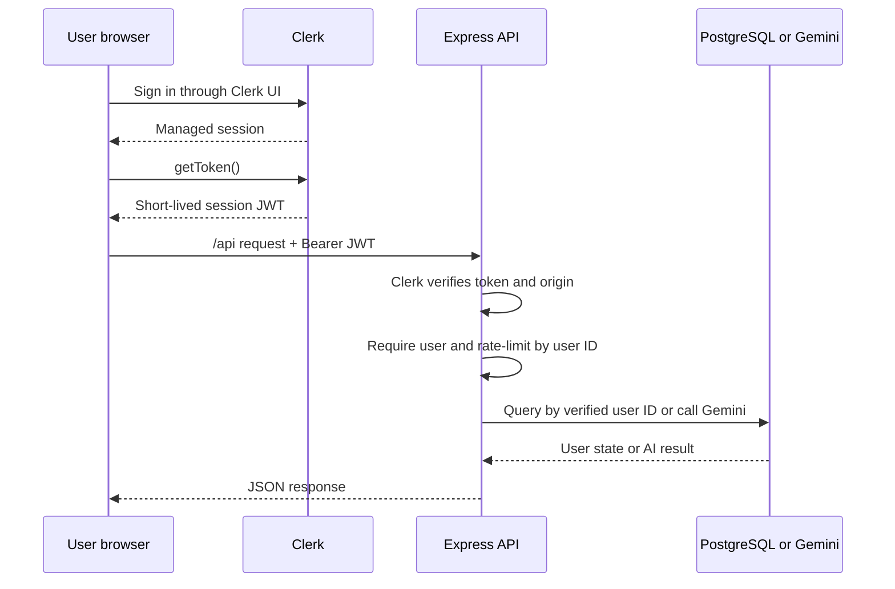

# Authentication architecture

Pawprint Network uses Clerk for identity and session management. The browser never receives the Clerk secret key or Gemini key. The Express server does not trust a user ID supplied by the browser; it obtains the identity from a Clerk-verified session token.

## Components

| Component | Code | Responsibility |
|---|---|---|
| Clerk provider configuration | `src/auth/clerkConfig.ts` | Loads the publishable key, rejects test keys in production, allows known redirect origins, and configures Instawoof as a satellite domain. |
| Sign-in gate | `src/components/ClerkAuthGate.tsx` | Waits for Clerk to load and renders Clerk's sign-in/sign-up UI before the app. |
| Account UI | `src/components/SocialAuthModal.tsx` | Displays the authenticated Clerk user, reports the real primary-email verification state, and delegates profile/security actions to Clerk. |
| Authenticated API client | `src/auth/useAuthenticatedApi.ts` | Gets a short-lived token from Clerk, restricts requests to same-origin `/api/` paths, and sends the token as a Bearer credential. |
| Clerk request verification | `server.ts` | Runs `clerkMiddleware()` and limits accepted request origins with `authorizedParties`. |
| API authorization guard | `server/auth.ts` | Reads Clerk's verified auth state with `getAuth(req)` and returns JSON `401` when no user is authenticated. |
| PostgreSQL repository | `server/stateRepository.ts` | Creates the state table and reads/writes rows using the verified Clerk user ID, species, and collection as parameterized values. |
| State synchronization | `src/utils/stateSync.ts` and `src/App.tsx` | Loads PostgreSQL first, seeds missing records from the user-scoped browser cache, and shows a warning when server synchronization fails. |
| User-scoped browser cache | `src/utils/storage.ts` | Names localStorage records with the Clerk user ID so two users on one browser do not share cached app state. It stores app content, never Clerk tokens. |

## Request flow

The public `/health` and `/api/health` endpoints are the only API-shaped routes that do not require a signed-in user. Render uses `/health` to decide whether the process is healthy. Every other `/api/*` request passes through authentication, per-user rate limiting, JSON parsing, and endpoint input validation in that order.

## Credentials and tokens

| Value | Visibility | Handling |
|---|---|---|
| `VITE_CLERK_PUBLISHABLE_KEY` | Public/browser | Embedded by Vite. A publishable key identifies the Clerk application and is not a secret. Production builds reject `pk_test_...` by default. |
| `CLERK_PUBLISHABLE_KEY` | Server environment | Used by Clerk's Express middleware and to construct the Clerk CSP origin. It must identify the same Clerk instance as the browser key. |
| `CLERK_SECRET_KEY` | Server secret | Read by Clerk from the process environment. It must never use a `VITE_` prefix, appear in source code, or be logged. Production rejects `sk_test_...` by default. |
| Clerk session JWT | Browser memory/request header | Requested with Clerk's `getToken()` and sent as `Authorization: Bearer ...` only to same-origin `/api/` paths. App code does not put it in localStorage or sessionStorage. Clerk remains responsible for its managed browser session. |
| `GEMINI_API_KEY` | Server secret | Read only by Express and sent only from the server to Gemini. It must never use a `VITE_` prefix. |
| `DATABASE_URL` | Server secret | Connects Express to the dedicated `pawprints_app` PostgreSQL role over `localhost`. It must never use a `VITE_` prefix or be committed. |
| App profiles/posts | PostgreSQL plus browser cache | PostgreSQL rows are partitioned by the server-verified Clerk user ID. Browser localStorage is only a per-user cache and migration source; it contains no Clerk token. |

The application never accepts `user_id` in a state request body or URL. `server/auth.ts` derives it from Clerk's verified request state and places it in `res.locals.auth`; `server.ts` then passes that value to parameterized repository queries. A browser therefore cannot select another account's partition merely by changing request data.

## Multiple domains

`pawprintsnetwork.com` is the primary Clerk domain. The `instameow.app` and `instawoof.app` brand domains, including their `www` hostnames, are configured as satellites in `src/auth/clerkConfig.ts` from environment variables. The frontend uses Clerk's URL-aware `isSatellite` and `domain` callbacks, while API calls use an explicit Bearer token. The server's `CLERK_AUTHORIZED_PARTIES` list prevents tokens issued from unexpected browser origins from being accepted.

The same primary and satellite relationship must also be configured in the Clerk production dashboard. Source configuration alone cannot create or verify Clerk DNS records.

## Failure behavior

- Missing or invalid authentication returns `401` JSON.
- Excessive requests return `429` JSON; the current limit is 30 authenticated API calls per user per minute.
- Invalid fields, modes, image types, or image sizes return `400` JSON.
- Oversized JSON bodies return `413` JSON.
- Internal provider errors are logged on the server and returned to the browser as generic messages; stack traces and provider error text are not exposed.
- Missing or development-only production credentials stop the process at startup instead of silently deploying an insecure configuration.
- A missing or unreachable database stops server startup; a later browser sync failure leaves a visible warning while retaining a local cache.

## Product boundary

The current PostgreSQL model gives each authenticated Clerk account durable, cross-device state. Each collection is stored as JSONB and updated as a whole. It is not yet a normalized public social graph: feeds are not shared across users, uploads do not yet use an object store, and simultaneous edits from multiple tabs are last-write-wins. Those are product-model limitations, not authentication bypasses.
